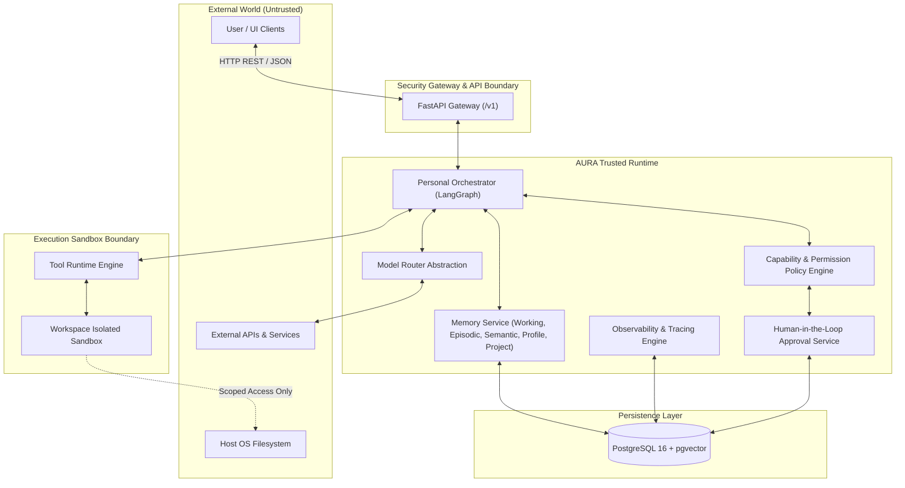
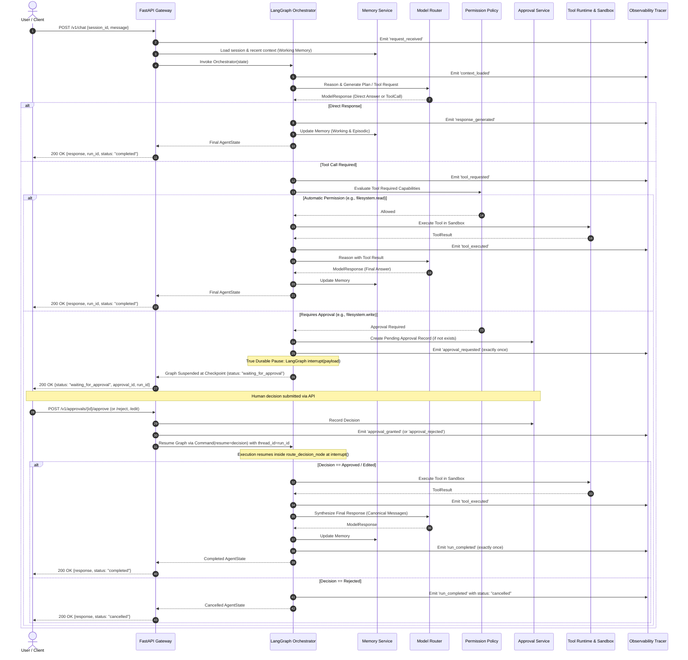

# AURA System Architecture Specification

## Document Overview
- **Project Codename:** AURA (Adaptive User Runtime Agent)
- **Status:** Approved / Active
- **Version:** 1.0.0 (Phase 0 & 1 Baseline)
- **Author:** Lead Systems Architect & Implementation Engineer

---

## 1. System Overview & Boundaries

AURA is a production-grade personal AI agent runtime designed for persistence, security, predictability, and extensibility. Unlike basic chatbots that merely stream completions over an unbounded chat history, AURA treats the agent as a long-running, stateful operating process with discrete memory subsystems, sandboxed execution boundaries, capability-based permission checks, and explicit human-in-the-loop approvals.



### System Boundaries
1. **API Boundary:** External clients communicate strictly via typed REST APIs (`/v1/chat`, `/v1/approvals`, `/v1/sessions`, `/v1/runs`). No internal agent state dictionaries or memory handles are directly exposed.
2. **Model Boundary:** The orchestrator never calls vendor SDKs directly. All requests pass through a provider-neutral `ModelRouter`.
3. **Tool & Sandbox Boundary:** Tools execute within a confined sandbox. Tools interacting with the host filesystem are restricted to a strictly configured workspace directory. Any path traversal outside the workspace is denied.
4. **Approval Boundary:** Destructive or state-mutating actions (such as filesystem modifications or shell execution) require explicit approval before execution. Execution halts until an approval decision is recorded.
5. **Persistence Boundary:** All state (sessions, messages, runs, traces, approvals, and episodic memories) is persisted to relational storage (PostgreSQL). State is never solely retained in volatile process memory.

---

## 2. Major Components

| Component | Module Path | Responsibility |
| :--- | :--- | :--- |
| **API Gateway** | `app.api` | Request validation, authentication, route dispatching, response serialisation. |
| **Personal Orchestrator** | `app.orchestrator` | LangGraph-based state machine managing the agent reasoning, tool dispatch, approval pause/resume, and lifecycle. |
| **Model Router** | `app.models` | Provider-neutral model execution, fallback handling, provider abstraction (OpenAI, Gemini, Local, Mock). |
| **Memory Subsystem** | `app.memory` | Multi-tier memory architecture (Working, Episodic, Semantic, Profile, Project). |
| **Tool Runtime** | `app.tools` | Registry and execution harness for declared tools with metadata, schema validation, and capability requirements. |
| **Capability & Approval** | `app.approvals` | Capability taxonomy, permission policy enforcement, pending approval management. |
| **Sandbox Environment** | `app.sandbox` | Isolation boundary enforcing workspace jail and future containerised execution. |
| **Observability & Tracing**| `app.observability` | Structured event logging, persistent audit trails (`run_events`), run reconstruction. |
| **Database & Persistence**| `app.db` | SQLAlchemy 2.x models, async session management, Alembic migrations. |

---

## 3. Data Flow & Execution Lifecycle

The lifecycle of an interaction through `POST /v1/chat`:



---

## 4. Agent State & Lifecycle Model

### 4.1 `RunStatus` Lifecycle Enum
Every run in AURA progresses through an explicit, auditable lifecycle:
- `created`: Initial state upon API ingestion.
- `running`: Actively executing reasoning, context retrieval, or tool invocation.
- `waiting_for_approval`: Suspended at an interruption checkpoint pending human authorization.
- `completed`: Successfully finalized with answer synthesized and episodic memory committed (terminal).
- `failed`: Terminated abnormally due to an unrecoverable system or provider error (terminal).
- `cancelled`: Terminated cleanly due to human rejection or explicit cancellation (terminal).

**Single-Terminal-Event Invariant:** A run records exactly one terminal event (`run_completed` or `run_failed`) upon reaching a terminal state. Resuming from an interruption does not duplicate `approval_requested` or produce premature completions.

### 4.2 Failure Taxonomy
Failures are explicitly categorized in runtime events, tool outputs, and audit traces:
- `tool_failure`: A tool raised an unhandled exception or failed during execution.
- `provider_failure`: An external LLM provider returned a network error, rate limit, or invalid response.
- `permission_failure`: An operation violated permission policies or attempted an unauthorized capability / path traversal escape.
- `approval_rejection`: A user explicitly denied authorization for a requested tool invocation.
- `graph_failure`: Orchestration state error, cyclic execution timeout, or serialization failure.

### 4.3 `AgentState` Definition
```python
class AgentState(TypedDict):
    run_id: str                      # Unique UUID for the current execution run
    session_id: str                  # Session UUID representing conversation thread
    user_message: str                # Current user input message
    messages: list[dict[str, Any]]   # Canonical conversation turns: system, user, assistant, tool
    retrieved_context: list[str]     # Injected memory context items
    current_plan: str | None         # High-level plan or reasoning scratchpad
    tool_requests: list[dict]        # Pending or active tool calls from model (with id, name, arguments)
    tool_results: list[dict]         # Executed tool results (with tool_call_id, name, result payload)
    approval_id: str | None          # Associated approval ID if paused
    approval_state: str              # "none" | "pending" | "approved" | "rejected" | "edited"
    tool_approvals: dict[str, dict]  # Per-tool approval decisions keyed by tool_call_id
    execution_status: str            # RunStatus value: "running" | "waiting_for_approval" | "completed" | "cancelled" | "failed"
    errors: list[str]                # Trace of non-fatal and fatal categorized errors
    final_response: str | None       # Final markdown answer intended for the user
```

### 4.4 Canonical Conversation Schema
Multi-turn context preserves genuine role structures rather than squashing tool calls into assistant text:
1. `system`: Injected system instructions and retrieved episodic memory grounding.
2. `user`: Explicit user turn content.
3. `assistant`: Model response optionally containing structured `tool_calls` (`id`, `name`, `arguments`).
4. `tool`: Tool execution outputs explicitly correlated via `tool_call_id` and `name`.
5. `assistant`: Final synthesis grounding response in tool results.

---

## 5. Trust & Security Boundaries

### 5.1 Trust Model
- **Untrusted:** Raw user inputs, external network payloads, and unverified model outputs (which may hallucinate commands or attempt jailbreaks).
- **Semi-Trusted:** The LLM reasoning outputs (treated as untrusted proposals until verified by the permission and sandbox layers).
- **Trusted:** The core orchestrator, memory service, capability engine, and approval service running inside the AURA host environment.

### 5.2 Model-Provider Boundary
- Orchestrator components interact exclusively with `ModelRouter`.
- `ModelRouter` accepts typed `ModelRequest` with an explicit `RoutingContext` (`task_type`, `complexity`, `privacy_requirement`, `latency_preference`, `cost_preference`, `required_capabilities`) and returns typed `ModelResponse`.
- Provider implementations (`OpenAIProvider`, `MockProvider`, etc.) adapt vendor APIs to AURA internal domain schemas.
- Provider secrets are read strictly from application settings; they are never passed through conversation state or logged.

### 5.3 Memory Boundary
Memory is partitioned into five distinct cognitive tiers:
1. **Working Memory:** Current turn execution state and active session conversation buffer.
2. **Episodic Memory:** Chronological narrative records of significant past runs, decisions, and tool executions.
3. **Semantic Memory:** Extracted declarative facts, indexed with vector embeddings (`pgvector`) for cosine similarity retrieval. *(Note: Phase 1 provides schema-only foundations; active vector search is scheduled for Phase 2).*
4. **Profile Memory:** Key-value store of persistent user preferences, system constraints, and identity details.
5. **Project Memory:** Contextual facts, workspace paths, and domain knowledge scoped to a specific project.

### 5.4 Hardened Tool Sandbox Boundary
- Every tool declares explicit required capabilities (`filesystem.read`, `filesystem.write`, `shell.execute`, `network.access`).
- Tools never perform self-authorization. Authorization is strictly performed by `PermissionPolicy`.
- **Hardened Path Security:** All filesystem tools resolve candidate paths via `resolve_workspace_path()`:
  - **Null byte rejection:** Rejects embedded `\0` null bytes immediately.
  - **Absolute path confinement:** If an absolute path is supplied, it must resolve strictly inside `AURA_WORKSPACE_ROOT`.
  - **Nested traversal prevention:** Paths with deep relative traversals (`../../`) are evaluated against the canonical root.
  - **Symlink & Junction escape defense:** Path resolution resolves all symbolic links, junctions, and relative segments (`Path.resolve()`). If the resolved target path is not relative to `workspace_root.resolve()`, access is rejected with `ACCESS DENIED` and classified as `permission_failure`.

### 5.5 Sandbox Boundary
- In Phase 1, the sandbox boundary is enforced at the filesystem level: directory jailing to `AURA_WORKSPACE_ROOT`.
- In Phase 2, shell and code execution tools will run exclusively inside ephemeral container sandboxes (e.g., rootless Docker or gVisor) with network egress isolation and strict resource quotas.

### 5.6 Approval & Checkpoint Security Boundary
- The approval layer enforces Human-in-the-loop control with per-tool granularity:
  - Approvals are explicitly bound to a specific `tool_call_id`. Approving one tool call never authorizes another unapproved call.
  - In multi-tool runs, permissions are evaluated independently; safe calls auto-execute, and dangerous calls trigger sequential LangGraph interruptions.
  - In `execute_tool_node`, defense-in-depth ensures that any call without an explicit `approved` or `edited` status in `tool_approvals` is blocked and never executed.
  - Checkpoint persistence uses `AsyncSqliteSaver` with `LANGGRAPH_STRICT_MSGPACK=true` to enforce strict MessagePack serialization and prevent untrusted Python object deserialization vulnerabilities.
  - Resumption via `/v1/approvals/{approval_id}/decision` reconciles DB records against graph thread snapshots, guaranteeing crash recovery and idempotency upon duplicate requests or client retries.

---

## 6. Future Event-Driven Architecture

In future phases, AURA will support autonomous and proactive operations triggered by external events:
- **Event Ingestion:** Webhook receivers, file system watchers, and cron schedulers publish events to an internal event bus.
- **Event Normalization:** Raw events are transformed into standard `AgentEvent` objects.
- **Proactive Run Dispatch:** An Event Dispatcher identifies matching triggers, retrieves associated profile/project memory, and creates a background execution run with the Personal Orchestrator.

---

## 7. Future Specialist Agent Architecture

Specialist agents will be integrated as specialized sub-graphs or worker nodes under the Personal Orchestrator:
- **Root Controller:** The Personal Orchestrator remains the root controller, retaining memory ownership, user relationship, and approval governance.
- **Specialists:** Research Agent, Coding Agent, Computer Agent, and Writing Agent will be invoked with scoped sub-tasks, returning structured artifacts to the orchestrator for verification before memory commit.

---

## 8. Summary of Architectural Principles

1. **Explicit over implicit:** State and decisions are clear, typed, and auditable.
2. **Fail-safe defaults:** Unrecognized capabilities default to denial. File writes default to requiring approval.
3. **Zero-secret leakage:** API keys and credentials never enter logging or message history.
4. **Resilience:** Restarts do not lose session history, runs, or pending approvals.
